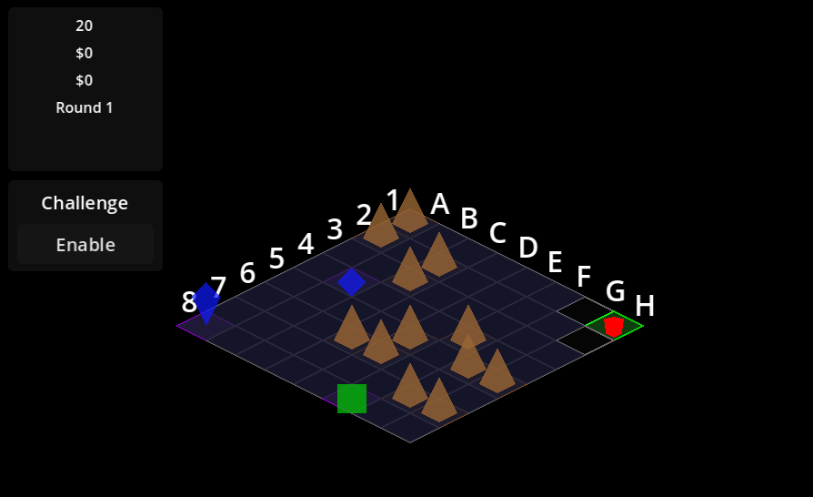

# Isometric Extraction

## About the Game

Isometric Extraction is a turn-based tactical survival game set on an 8x8 isometric grid. You are a scavenger in a post-apocalyptic world, tasked with gathering valuable resources while managing your limited time and energy.

## How to Play

### Core Gameplay

1. **Objective:** Gather as much money as possible from Points of Interest (POIs) and return to your starting position before running out of turns.
2. **Movement:** You can move 2 tiles per turn along the grid.
3. **Time Limit:** You have 20 turns to complete your mission.
4. **Win Condition:** Return to your starting position after collecting resources.

### Game Mechanics

- **Fog of War:** The map begins mostly hidden, with only tiles adjacent to your starting position revealed. As you move, adjacent tiles are revealed.
- **Points of Interest (POIs):** Colored shapes on the map that provide rewards when collected.
  - Green squares
  - Blue gems and diamonds
  - Yellow triangles
- **Grid Navigation:** The grid uses chess notation (A-H for columns, 1-8 for rows) to help you navigate.

### Controls

- Click on a visible tile to move your character there
- Confirm movement when prompted
- Watch your turn counter - plan your route carefully to ensure you can return to your starting position

### Tips for Success

1. **Plan Your Route:** POIs are placed in different quadrants of the map. Try to plan an efficient path to collect as many as possible.
2. **Mind Your Turns:** Always leave enough turns to return to your starting position.
3. **Prioritize High-Value POIs:** Some POIs offer more rewards than others.
4. **Watch for Obstacles:** Not all tiles may be passable. Adapt your strategy as you explore.

## Game Modes

- **Standard Mode:** Complete each round by collecting POIs and returning to your start position.
- **Challenge Mode:** Test your skills with additional obstacles and objectives.

## Credits

Developed as an isometric game prototype using Godot Engine.

---

Happy scavenging!
